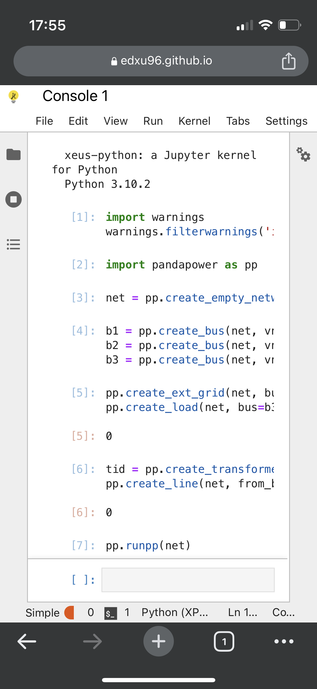

# psa-notebook: power system analysis in the browser

 

[`edxu96.github.io/psa-notebook`](https://edxu96.github.io/psa-notebook) provides a Jupyter notebook working environment, with `pandapower`, `networkx`, `seaborn` and other useful packages pre-installed.

## Kernels

The version of [`xeus-python`](https://xeus-python.readthedocs.io/en/latest/) is 3.10.2. For now, Python packages can only be added during the build of the kernel. `environment.yml` specifies which packages are added. The available packages are listed in the appendix.

In contrast, any Python package with [pure Python wheels](https://packaging.python.org/en/latest/guides/distributing-packages-using-setuptools/#pure-python-wheels) available on [PyPI](https://pypi.org/) can be installed in the [Pyodide](https://pyodide.org/en/stable/) kernel.

The [`xeus-sqlite`](https://xeus-sqlite.readthedocs.io/en/latest/) kernel is also available.

## Requirements of the browser

JupyterLite is being tested against modern web browsers:

- Firefox 90+
- Chromium 89+

## Appendix

The available Python packages in the `xeus-python` kernel are:

| Package                       | Version |
| ----------------------------- | ------- |
| asttokens                     | 2.2.1   |
| backcall                      | 0.2.0   |
| backports-functools-lru-cache | 1.6.4   |
| cffi                          | 1.15.0  |
| cryptography                  | 3.3.2   |
| cycler                        | 0.11.0  |
| decorator                     | 5.1.1   |
| executing                     | 1.2.0   |
| fonttools                     | 4.29.1  |
| ipython                       | 7.32.0  |
| jedi                          | 0.18.2  |
| matplotlib                    | 3.5.2   |
| matplotlib-inline             | 0.1.6   |
| networkx                      | 3.1     |
| numpy                         | 1.24.2  |
| packaging                     | 23.1    |
| pandapower                    | 2.4.0   |
| pandas                        | 1.4.3   |
| parso                         | 0.8.3   |
| patsy                         | 0.5.2   |
| pexpect                       | 4.8.0   |
| pickleshare                   | 0.7.5   |
| prompt-toolkit                | 3.0.38  |
| ptyprocess                    | 0.7.0   |
| pure-eval                     | 0.2.2   |
| pycparser                     | 2.21    |
| pygments                      | 2.15.0  |
| pyparsing                     | 3.0.9   |
| python-dateutil               | 2.8.2   |
| pytz                          | 2023.3  |
| requests-wasm-polyfill        | 0.3.0   |
| scipy                         | 1.8.1   |
| seaborn                       | 0.12.2  |
| six                           | 1.16.0  |
| stack-data                    | 0.6.2   |
| statsmodels                   | 0.13.2  |
| traitlets                     | 5.9.0   |
| typing-extensions             | 4.5.0   |
| unknown                       | 9.1.0   |
| wcwidth                       | 0.2.6   |
| xeus-python-shell             | 0.5.0   |
| xlrd                          | 2.0.1   |
| xlsxwriter                    | 3.0.9   |
